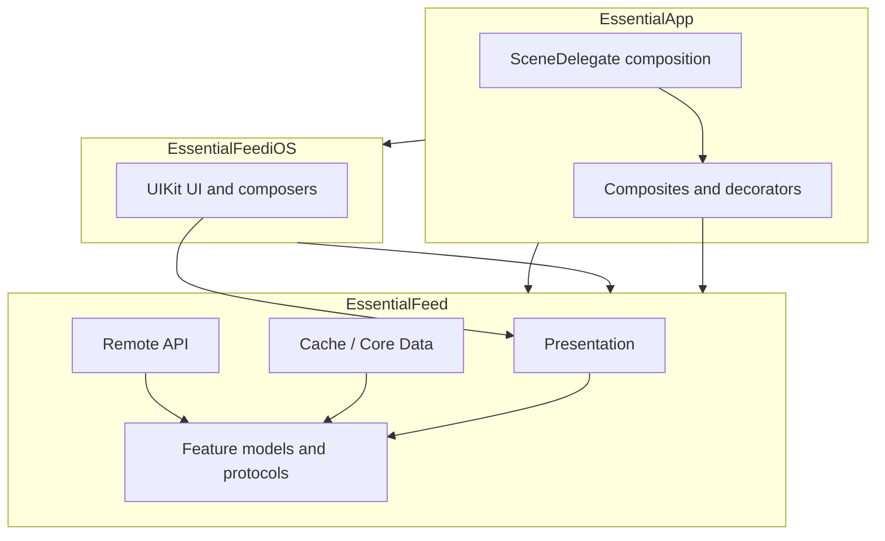

# EssentialFeed — agent reference

This document summarizes how the Xcode workspace is structured, how modules depend on each other, and which tests to run after touching different parts of the codebase.

## Workspace and projects

| Path | Role |
|------|------|
| `EssentialApp.xcworkspace` | Top-level workspace: includes `EssentialFeed/EssentialFeed.xcodeproj` and `EssentialApp/EssentialApp/EssentialApp.xcodeproj`. Use this for **iOS simulator** builds that involve the app and linked frameworks. |
| `EssentialFeed/EssentialFeed.xcodeproj` | Core framework project: **EssentialFeed**, **EssentialFeediOS**, and all library test bundles (also used for **CI_macOS** with `-project`). |
| `EssentialApp/EssentialApp/EssentialApp.xcodeproj` | Host iOS app **EssentialApp** and **EssentialAppTests** (composition-layer tests). |
| `EssentialFeed/Prototype/Prototype.xcodeproj` | Standalone UI prototype; not part of CI or the main dependency graph. |

## Modules (targets) and responsibilities

### `EssentialFeed` (dynamic framework)

- **Platforms:** iOS and macOS (`SUPPORTED_PLATFORMS` includes `iphoneos`, `iphonesimulator`, `macosx`).
- **Role:** Domain and application logic with **no UIKit** in the public feature surface (networking, caching, use cases, presenters/view models, Core Data store implementation).
- **Main source layout** (`EssentialFeed/EssentialFeed/`):
  - `Feed Feature/` — `FeedImage`, `FeedLoader`, `FeedImageDataLoader`, cache protocols.
  - `Feed API/` — `HTTPClient`, `URLSessionHTTPClient`, `RemoteFeedLoader`, `RemoteFeedImageDataLoader`, mappers, helpers.
  - `Feed Cache/` — `LocalFeedLoader`, `FeedStore` / `FeedImageDataStore`, `FeedCachePolicy`, Core Data stack under `Infrastructure/CoreData/`.
  - `Feed Presentation/` — `FeedPresenter`, loading/error/view models, localization resources.

### `EssentialFeediOS` (dynamic framework)

- **Platform:** iOS only; **embeds** `EssentialFeed.framework`.
- **Role:** UIKit presentation: `FeedUIComposer`, table view controllers/cells, adapters, main-queue decorators, storyboard/assets under `Feed UI/`.

### `EssentialApp` (iOS application)

- **Role:** Composition root: wires concrete implementations (`URLSessionHTTPClient`, `CoreDataFeedStore`, remote/local loaders) and **app-specific composites/decorators** (e.g. `FeedLoaderWithFallbackComposite`, `FeedLoaderCacheDecorator`, `FeedImageDataLoaderWithFallbackComposite`, `FeedImageDataLoaderCacheDecorator`) in `SceneDelegate`, then hands control to `FeedUIComposer.feedComposedWith(...)`.
- **Imports:** `EssentialFeed` and `EssentialFeediOS`.

### Dependency direction (high level)

## Test bundles (targets)

| Target | Project | What it validates |
|--------|---------|-------------------|
| **EssentialFeedTests** | EssentialFeed | Fast **unit** tests: remote/cache use cases, `URLSessionHTTPClient`, presenters, localization, Core Data store tests driven from specs, spies/helpers. Default scheme uses **Thread Sanitizer** (see `EssentialFeedTests/EssentialFeed.xctestplan`). |
| **EssentialFeediOSTests** | EssentialFeed | **UIKit integration** tests for the feed UI (`FeedUIIntegrationTests` and helpers) — iOS simulator. |
| **EssentialFeedAPIEndToEndTests** | EssentialFeed | Hits the **live Essential Developer API** (`ile-api.essentialdeveloper.com`); verifies feed count and image data against fixed expectations. **Network + external dependency.** |
| **EssentialFeedCacheIntegrationTests** | EssentialFeed | **Integration** tests for `LocalFeedLoader` / cache behavior with real `CoreDataFeedStore` on disk (separate instances, save/load/delete flows). |
| **EssentialAppTests** | EssentialApp | Unit tests for **app-layer** composites and cache decorators (fallback and cache decoration), using spies/stubs. |

## Test plans (`.xctestplan`)

| File | Contents |
|------|----------|
| `EssentialFeed/EssentialFeedTests/EssentialFeed.xctestplan` | **EssentialFeedTests** only; TSAN on; one test skipped (`CodableFeedStoreTests/...` — legacy skip entry). |
| `EssentialFeed/EssentialFeedTests/CI_macOS.xctestplan` | **EssentialFeedAPIEndToEndTests** + **EssentialFeedCacheIntegrationTests** + **EssentialFeedTests** — full macOS CI bundle for the library. |
| `EssentialFeed/CI_iOS.xctestplan` | **EssentialFeedAPIEndToEndTests** + **EssentialFeedCacheIntegrationTests** + **EssentialFeedTests** + **EssentialFeediOSTests** + **EssentialAppTests** — full iOS CI surface. |
| `EssentialFeed/EssentialFeedEndToEndTests.xctestplan` | **EssentialFeedAPIEndToEndTests** only. |
| `EssentialFeed/EssentialFeedCacheIntegrationTests/EssentialFeedCacheIntegrationTestPlan.xctestplan` | **EssentialFeedCacheIntegrationTests** only. |
| `EssentialFeed/EssentialFeediOSTests.xctestplan` | **EssentialFeediOSTests** only. |

The **EssentialApp** scheme’s test plan reference resolves to **`EssentialApp.xctestplan` at the repository root** (alongside `EssentialApp.xcworkspace`). That file may be absent in some clones; if so, run **EssentialAppTests** directly from the scheme or add/recreate the test plan so the reference resolves.

## Shared CI commands (from `.github/workflows/CI.yml`)

- **macOS (library + E2E API + cache integration):**  
  `xcodebuild clean build test -project EssentialFeed/EssentialFeed.xcodeproj -scheme "CI_macOS" -destination "platform=macOS" CODE_SIGN_IDENTITY="" CODE_SIGNING_REQUIRED=NO`

- **iOS (full stack including app + iOS UI tests):**  
  `xcodebuild clean build test -workspace EssentialApp.xcworkspace -scheme "CI_iOS" -destination 'platform=iOS Simulator,name=iPhone 15' CODE_SIGN_IDENTITY="" CODE_SIGNING_REQUIRED=NO`

## What to run locally (by area of change)

Use **fast, deterministic** tests while iterating; defer slow or environment-dependent suites to CI unless you are editing those layers directly.

### Everyday local loop (recommended)

| You changed… | Run first (minimal) |
|--------------|----------------------|
| `EssentialFeed/EssentialFeed/` — API, cache, presentation | **EssentialFeed** scheme → **EssentialFeedTests** (macOS; uses `EssentialFeed.xctestplan`). |
| `EssentialFeed/EssentialFeediOS/` | **EssentialFeediOSTests** scheme (iOS Simulator) or `CI_iOS` when you need the full iOS stack. |
| `EssentialApp/EssentialApp/EssentialApp/` — composites, `SceneDelegate` | **EssentialApp** scheme → **EssentialAppTests** (iOS Simulator). |

### Run less often locally (CI is the default home)

| Suite | When to run locally |
|-------|---------------------|
| **EssentialFeedAPIEndToEndTests** | After changes to live URL usage, `RemoteFeedLoader`/`RemoteFeedImageDataLoader` contract with the real server, or debugging API failures. Requires network and stable test account data. |
| **EssentialFeedCacheIntegrationTests** | After significant **Core Data** / `LocalFeedLoader` / store lifecycle changes where unit tests are not enough. |
| **CI_macOS** / **CI_iOS** full plans | Before merge, when touching cross-target behavior, or after large refactors — mirrors GitHub Actions. |

### Quick mapping: source folders → tests

| Code | Primary tests |
|------|-----------------|
| `Feed API/` | `EssentialFeedTests/Feed API/` |
| `Feed Cache/` | `EssentialFeedTests/Feed Cache/` (+ **CacheIntegration** if persistence across instances matters) |
| `Feed Presentation/` | `EssentialFeedTests/Feed Presentation/` |
| `Feed Feature/` | Covered via API/cache/presentation tests |
| `EssentialFeediOS/` | `EssentialFeediOSTests/Feed UI/` |
| App composites / `SceneDelegate` | `EssentialAppTests/` |

## Notes for automation / agents

- Prefer **`EssentialFeed` scheme + `EssentialFeed.xctestplan`** for the fastest signal on core library edits (macOS, unit-only, TSAN).
- **E2E API tests** are not hermetic; treat failures as possibly environmental.
- **Prototype** app is optional for feature work; do not assume it is built in CI.
